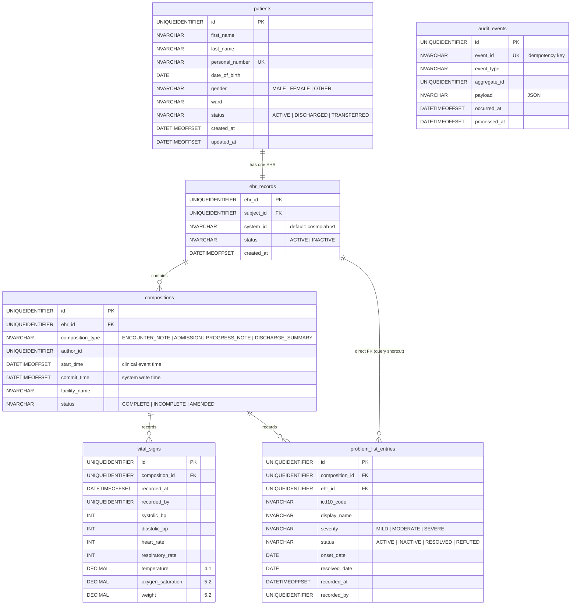

# CosmoLab — Domain Model ER Diagram

> Entity-relationship diagram derived from Flyway migrations V1–V7.
> All primary keys are `UNIQUEIDENTIFIER` (`NEWSEQUENTIALID()`). All text columns use `NVARCHAR` for Unicode (Swedish å ä ö support).

---

## Entity-Relationship Diagram



---

## openEHR Containment Hierarchy

The schema follows the openEHR containment model. Each level is a strict subset of the level above.

```
Patient (demographic record)
└── EHR (Electronic Health Record — one per patient, for life)
    └── Composition (a clinical encounter or document)
        ├── Observation → VitalSigns      (measured data)
        └── Evaluation → ProblemDiagnosis (clinical assessment)
```

**Patient** and **EHR** are in a strict 1:1 relationship enforced by `UNIQUE (subject_id)` on `ehr_records`. A patient has exactly one EHR for the lifetime of their care.

**Composition** represents a clinical encounter — an admission, a progress note, a discharge summary. All clinical entries (vitals, problems) belong to a composition, recording who authored it, when the encounter happened (`start_time`), and when it was saved to the system (`commit_time`).

**VitalSigns** is an OBSERVATION — directly measured data. Multiple vital sign readings may belong to one composition (e.g., two sets of observations during a single shift encounter).

**ProblemDiagnosis** is an EVALUATION — a clinical assessment with an ICD-10 code, severity, and lifecycle status. It carries two foreign keys intentionally:
- `composition_id` → the encounter that recorded the problem
- `ehr_id` → direct shortcut for efficient `WHERE ehr_id = ?` queries without joining through compositions

---

## Read Model — `vw_ward_patient_summary` (V8)

A SQL Server view that pre-joins the main tables for the ward overview query. Avoids N+1 queries in `WardOverviewService`.

```
vw_ward_patient_summary
├── patients.*       (id, name, ward, status, personal_number)
├── ehr_records.ehr_id
├── vital_signs.*    (latest only, via ROW_NUMBER() OVER PARTITION BY ehr_id ORDER BY recorded_at DESC)
└── active_problem_count  (correlated subcount: problem_list_entries WHERE status = 'ACTIVE')
```

The `ROW_NUMBER()` window function partitions vital sign rows per EHR and picks only `rn = 1` (most recent) — this is SQL Server's idiomatic way to get the latest row per group without a self-join.

---

## Key Indexes

| Table | Index | Columns | Purpose |
|---|---|---|---|
| `patients` | `UNIQUE` | `personal_number` | Prevent duplicate Swedish national IDs |
| `patients` | `NONCLUSTERED` | `(ward, status)` | Ward overview filter: `WHERE ward = ? AND status = 'ACTIVE'` |
| `compositions` | `NONCLUSTERED` | `(ehr_id, commit_time DESC)` | Paginated composition history per EHR |
| `vital_signs` | `NONCLUSTERED` | `(composition_id, recorded_at DESC)` | Latest vitals lookup per composition |
| `problem_list_entries` | `NONCLUSTERED` | `(ehr_id, status)` | Active problem filter per EHR |
| `audit_events` | `UNIQUE` | `event_id` | Idempotency — reject redelivered messages |
| `audit_events` | `NONCLUSTERED` | `(aggregate_id, occurred_at DESC)` | Audit trail lookup per entity |

---

## Constraints Summary

| Table | Constraint | Rule |
|---|---|---|
| `patients` | `chk_patients_status` | `IN ('ACTIVE','DISCHARGED','TRANSFERRED')` |
| `patients` | `chk_patients_gender` | `IN ('MALE','FEMALE','OTHER')` |
| `ehr_records` | `uq_ehr_subject` | One EHR per patient |
| `ehr_records` | `chk_ehr_status` | `IN ('ACTIVE','INACTIVE')` |
| `compositions` | `chk_composition_type` | `IN ('ENCOUNTER_NOTE','ADMISSION','PROGRESS_NOTE','DISCHARGE_SUMMARY')` |
| `compositions` | `chk_composition_status` | `IN ('COMPLETE','INCOMPLETE','AMENDED')` |
| `problem_list_entries` | `chk_problem_severity` | `IN ('MILD','MODERATE','SEVERE')` |
| `problem_list_entries` | `chk_problem_status` | `IN ('ACTIVE','INACTIVE','RESOLVED','REFUTED')` |
| `audit_events` | `UQ_audit_events_event_id` | Idempotent consumer: one insert per `event_id` |
